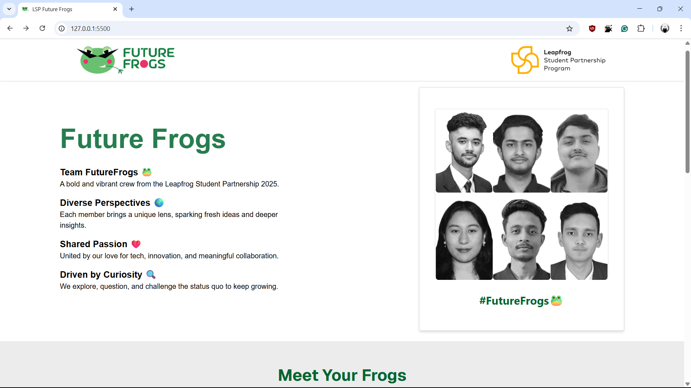
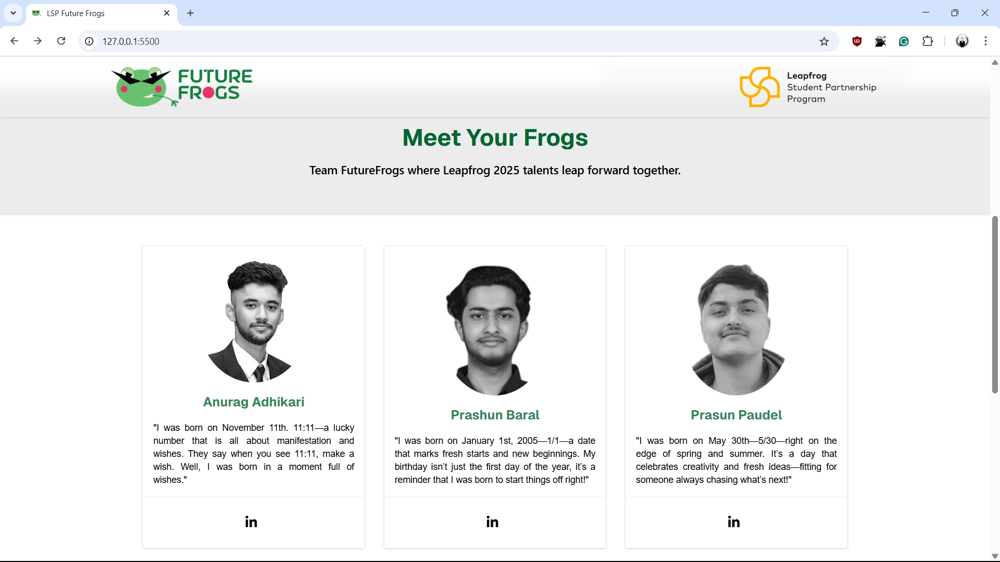
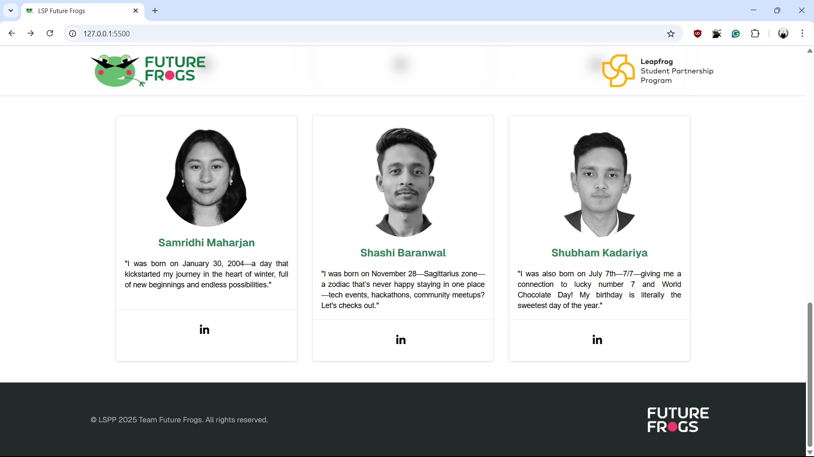
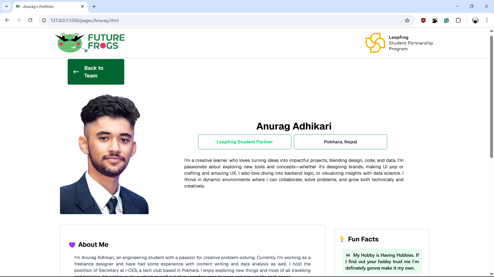
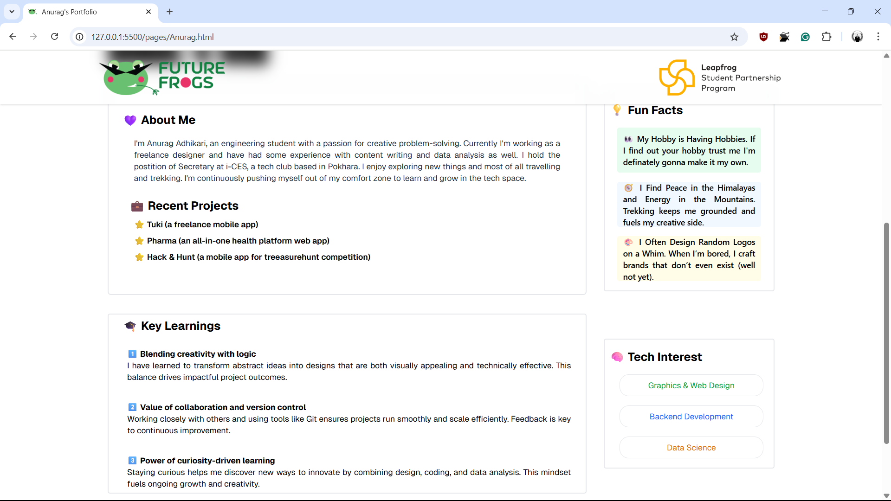

# Web App Assignment of Leapfrog Student Partnership Program

A simple and responsive landing page built using **vanilla HTML** and **Tailwind CSS** for the **Leapfrog Student Partnership Program**. This project focuses on clean UI, performance, and clarity—without using any frameworks or heavy libraries.

---

## 📌 Project Overview

This webpage serves as an introductory page for the team **Future Frogs**. It is lightweight and developed with simplicity in mind using core web technologies.

---

## 🔧 Tech Stack

- **HTML** – Semantic and accessible structure
- **Tailwind CSS** – Utility-first styling for fast and clean design

---

## 🚀 Features

- ✅ Responsive layout
- 🎨 Styled using Tailwind's utility classes
- 🧠 Clean, readable code – perfect for learning
- ⚡️ No heavy libraries or frameworks

---

## 🖥️ Walkthrough

**Hero/Landing Page:**

**Each Teammate Description Page:**

---

## 📂 Folder Structure

<pre>📁 FUTUREFROGS  
├── 📁 assets    
├── 📁 pages
├── index.html  
└── README.md  
</pre>

---

## 🧑‍💻 Contributors

- [Anurag Adhikari](https://github.com/anurag-adk)
- [Prashun Baral](https://github.com/prashunbaral)
- [Prasun Paudel](https://github.com/DevilGod129)
- [Samridhi Maharjan](https://github.com/samridhi-maharjan)
- [Shashi Baranwal](https://github.com/shashibaranwal)
- [Shubham Kadariya](https://github.com/Shubham-K77)

## 🙏 Thank You

_A Special Thank You To Our Mentors and Facilitators at Leapfrog especially Avishek Tiwari Dai_
